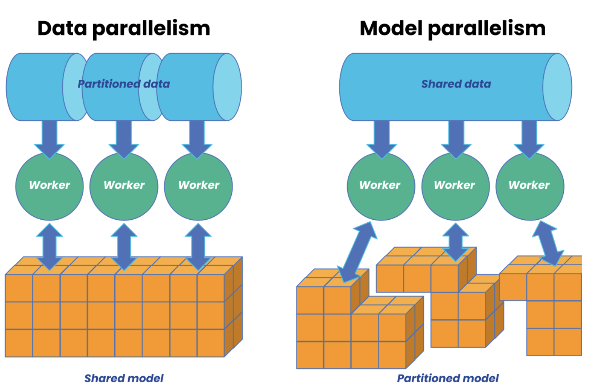

Hi, I am Akhmad. In this post, I share about Parallelization and memory optimization. Rest assured, my content is not AI-generated, though it has been revised for grammar and vocabulary using ChatGPT.

**Please note this is currently a draft.**

Parallelization is a crucial strategy for training large models at scale. As model sizes continue to grow, they will exceed the memory capacity of current GPUs or TPUs. Simply adding more resources will not suffice to scale the training effectively.

There are several approaches available, including data parallelism (DP), model parallelism (MP), pipeline parallelism (PP), CPU offloading, and ZeRO memory optimization and etc. . Each approach has distinct memory requirements and introduces varying levels of communication overhead.

## Data Parallelism

Data parallelism (DP) is used when batch sizes are too large to fit on a single machine. DP divides mini-batches evenly across data-parallel processes. In this approach, the model is duplicated on multiple devices, with each device processing a subset of the data simultaneously. Forward and backward propagation are performed on each device, and gradients are averaged across processes to update the model parameters locally.

Data parallelism is often considered easier to implement than model parallelism and is sufficient for most use cases.

## Model Parallelism

When a model exceeds the memory capacity of a single device, it is partitioned across multiple processors, with each processor computing its portion of the model's operations simultaneously.
Unlike data parallelism, where the entire model is replicated across devices and each processes different batches of data, model parallelism focuses on distributing the model itself.

Model parallelism can be combined with data parallelism to enable more efficient distributed training for large-scale models.

https://www.anyscale.com/blog/what-is-distributed-training

## Pipeline Parallelism

## CPU offloading

## Zero Memory optimization

## SIMD, MIMD
