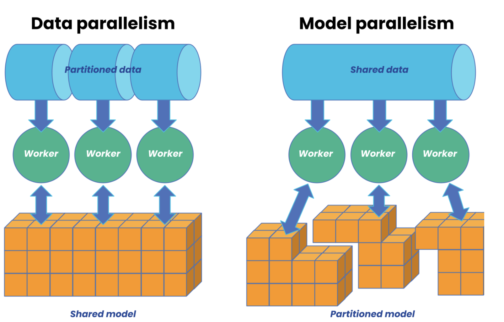
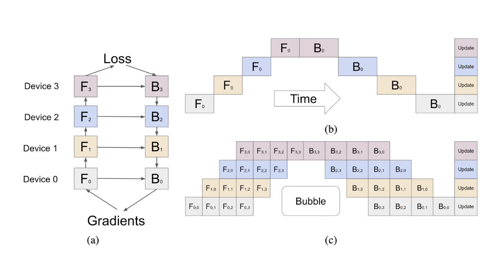

Hi, I am Akhmad. In this post, I share about parallelization and memory optimization in distributed training.

**Please note this is currently a draft.**

Parallelization is a crucial strategy for training large models at scale. As model sizes continue to grow, they will exceed the memory capacity of current GPUs or TPUs. Simply adding more resources will not suffice to scale the training effectively.

There are several approaches available, including data parallelism (DP), model parallelism (MP), pipeline parallelism (PP), CPU offloading, and ZeRO memory optimization and etc. . Each approach has distinct memory requirements and introduces varying levels of communication overhead.

## Data Parallelism

[Data parallelism](https://www.run.ai/blog/parallelism-strategies-for-distributed-training) (DP) is used when batch sizes are too large to fit on a single machine. DP divides mini-batches evenly across data-parallel processes. In this approach, the model is duplicated on multiple devices, with each device processing a subset of the data simultaneously. Forward and backward propagation are performed on each device, and gradients are averaged across processes to update the model parameters locally.

Data parallelism is often considered easier to implement than model parallelism and is sufficient for most use cases.

## Model Parallelism

When a model exceeds the memory capacity of a single device, it is partitioned across multiple processors, with each processor computing its portion of the model's operations simultaneously.
Unlike data parallelism, where the entire model is replicated across devices and each processes different batches of data, model parallelism focuses on distributing the model itself.

Model parallelism can be combined with data parallelism to enable more efficient distributed training for large-scale models.

https://www.anyscale.com/blog/what-is-distributed-training

## Pipeline Parallelism

[Pipeline parallelism](https://arxiv.org/pdf/1811.06965) divides the model (groups of layers) into sequential stages. The input data is split into micro-batches, which pass through the pipeline, with each stage processing its portion of the data. At any given time, multiple micro-batches are processed simultaneously at different stages of the pipeline.

(a) An example neural network with sequential layers is partitioned across four accelerators.
(b) The naive model parallelism strategy results in severe under-utilization due to the sequential dependency of the network.
(c) Pipeline parallelism divides the input mini-batch into smaller micro-batches, enabling different accelerators to work on distinct micro-batches simultaneously. Gradients are applied synchronously at the end.

## CPU offloading

CPU offloading exploits the heterogeneous nature of modern compute nodes. It is used in deep learning and other computationally intensive tasks to offload resource-intensive operations from the main processor (GPU) to the CPU. This approach heavily relies on memory bandwidth and is therefore constrained by PCI-E. As a result, up to 50% of training time can be spent on GPU-CPU-GPU transfers.

## ZeRO Memory optimization

ZeRO [(Zero Redundancy Optimizer)](https://arxiv.org/abs/1910.02054v3) is designed to handle models with trillions of parameters. It addresses the challenges of limited device memory and eliminates redundancies in both data-parallel and model-parallel training approaches. ZeRO divides memory consumption into model states (optimizer states, gradients, and parameters) and residual states (activations, temporary buffers, and fragmented memory). Instead of replicating the model, ZeRO partitions it, achieving linear memory reduction per device used. Some recomputation may be necessary if parameters are not locally available, which is the trade-off for more efficient memory usage.

## Resources used:

[Parallelism Strategies for Distributed Training](https://www.run.ai/blog/parallelism-strategies-for-distributed-training)

[What is distributed training](https://www.anyscale.com/blog/what-is-distributed-training)

[GPipe: Easy Scaling with Micro-Batch Pipeline Parallelism](https://arxiv.org/pdf/1811.06965)

[ZeRO: Memory Optimizations Toward Training Trillion Parameter Models](https://arxiv.org/abs/1910.02054v3)
